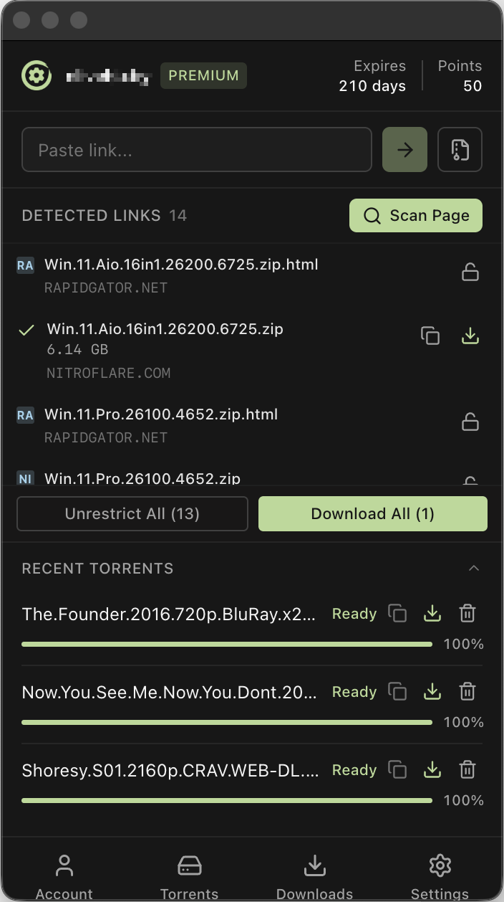
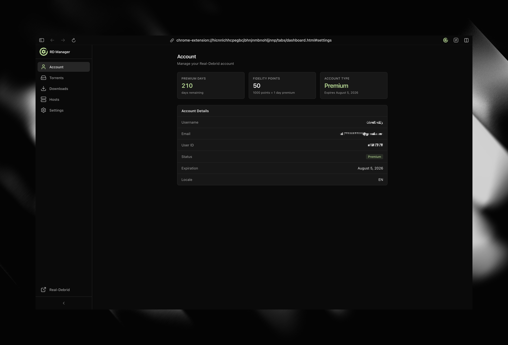
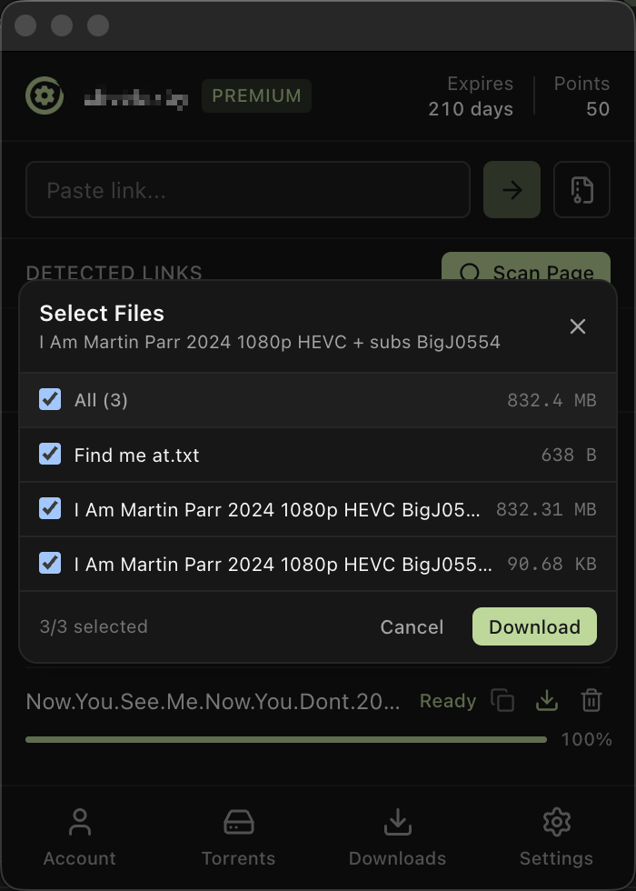
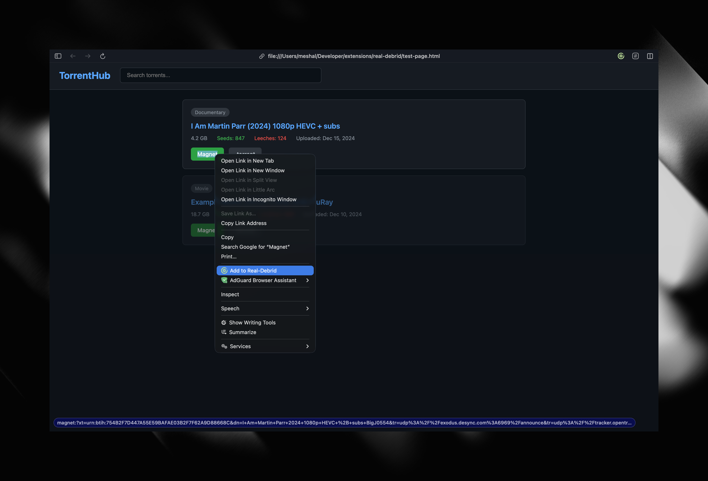
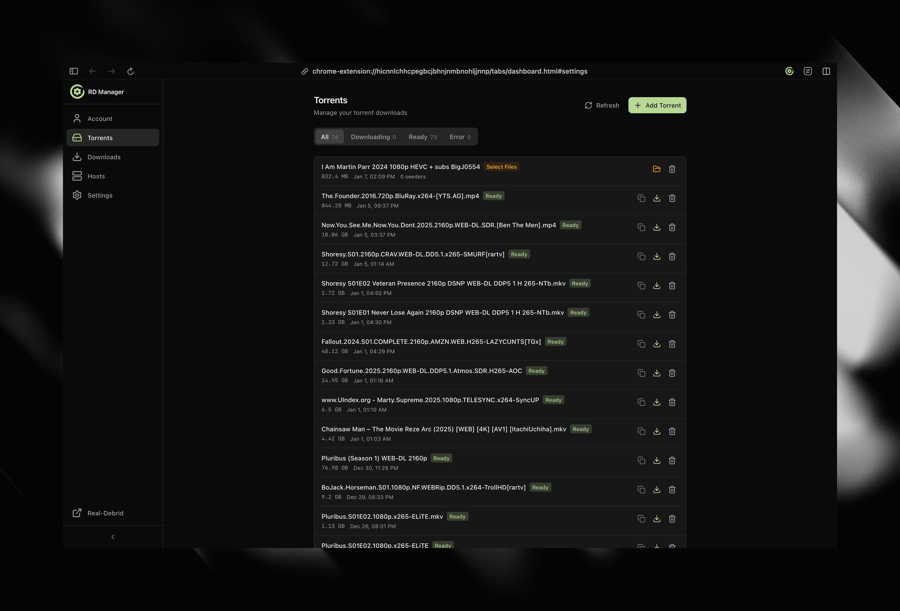
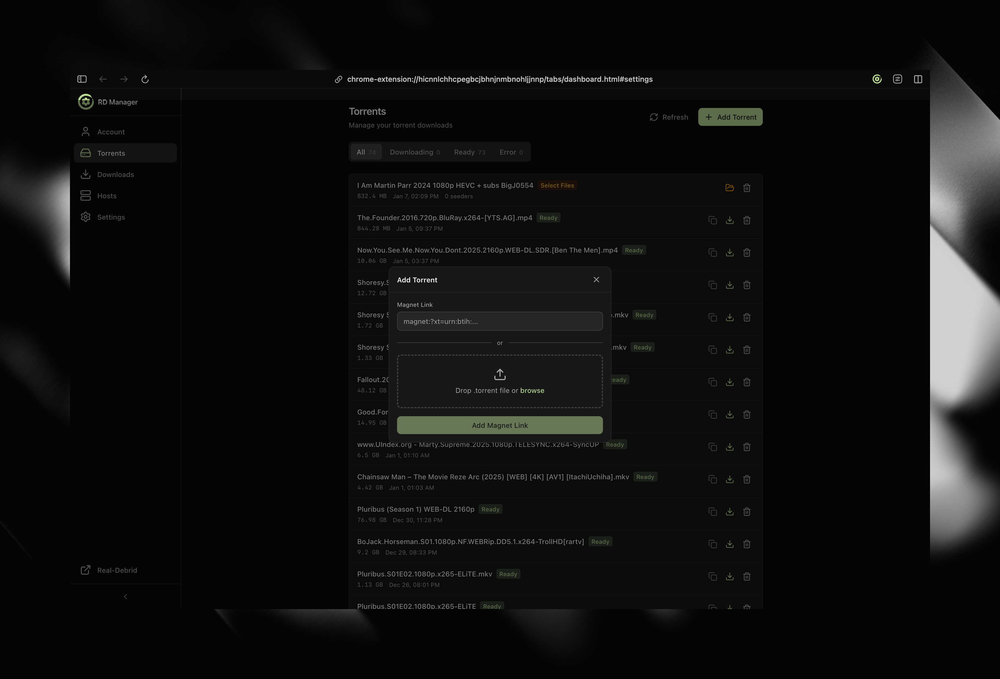
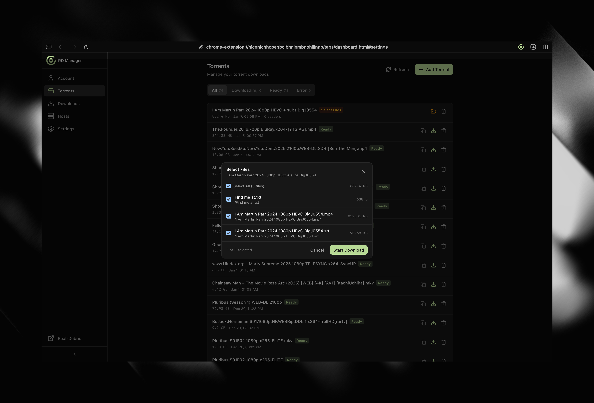
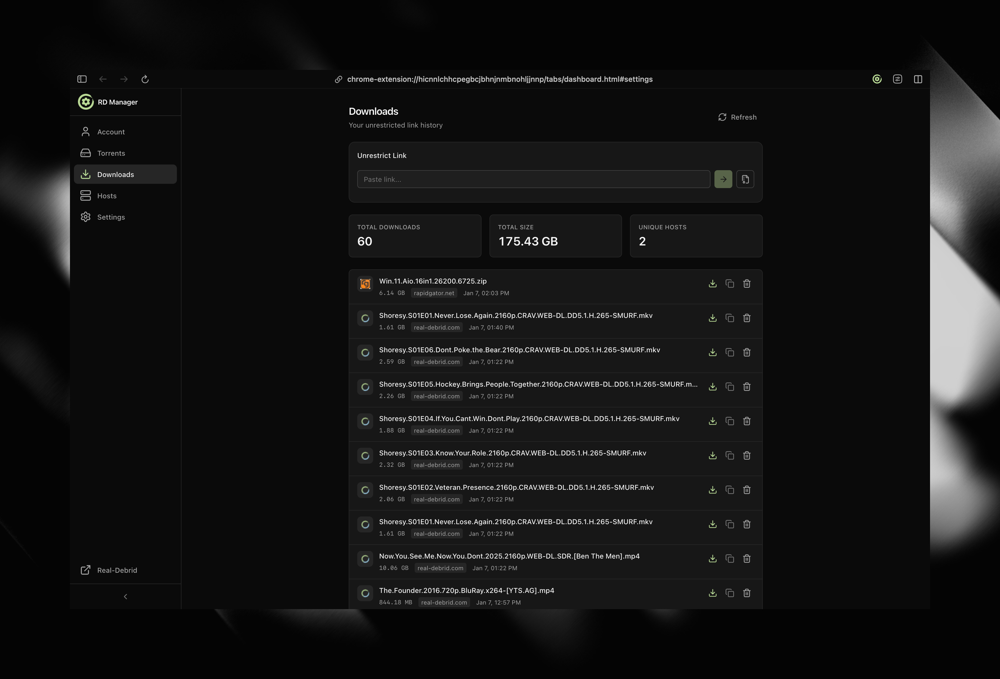
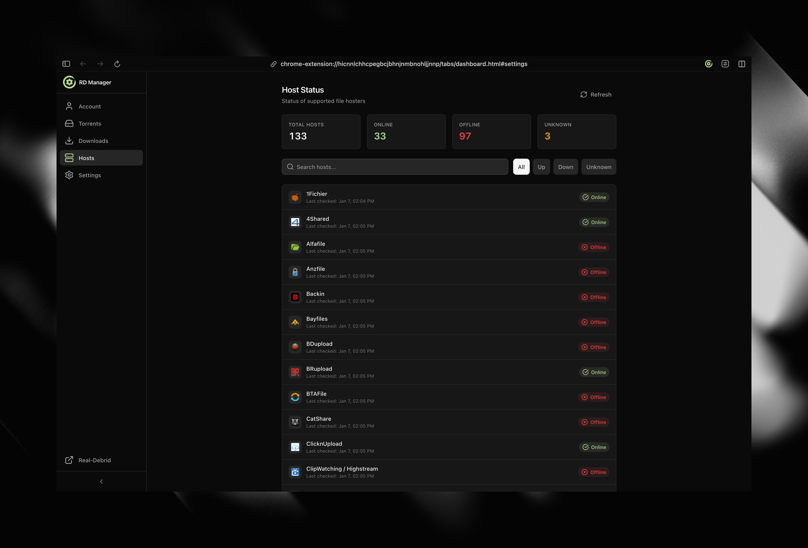
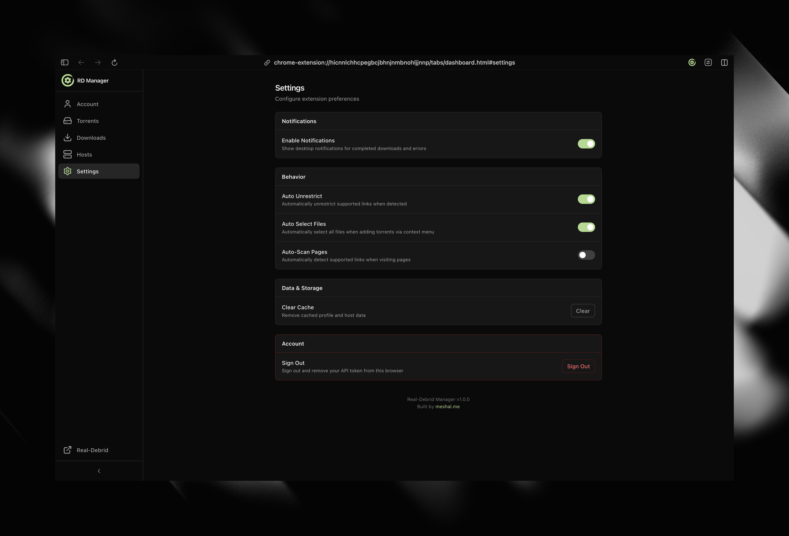

<p align="center">
  
</p>

<h1 align="center">Real-Debrid Manager</h1>

<p align="center">
  Browser extension for Real-Debrid - unrestrict links, manage torrents, and monitor your account.
</p>

<p align="center">
  <a href="#"></a>
  <a href="#"></a>
  
  
</p>

---

## Screenshots

<p align="center">
  
  &nbsp;&nbsp;&nbsp;
  
</p>

<details>
<summary>More screenshots</summary>
<br>

| | |
|:---:|:---:|
|  |  |
| Popup - File selection | Context menu |
|  |  |
| Dashboard - Torrents | Dashboard - Add torrent |
|  |  |
| Dashboard - Select files | Dashboard - Downloads |
|  |  |
| Dashboard - Hosts | Dashboard - Settings |

</details>

---

## Features

### Link Unrestriction
- Paste any supported hoster link to get premium download speeds
- Scan webpages for supported links and unrestrict them in batch
- Right-click any link to unrestrict directly

### Torrent Management
- Add magnet links and torrent files
- Select specific files to download
- Monitor progress with real-time status updates
- Get notified when downloads complete

### Account Dashboard
- View premium status, points, and expiration
- Browse download history
- Check supported hosts
- Manage settings

---

## Installation

### Browser Stores

- **Chrome**: [Chrome Web Store](#) <!-- TODO: Add link -->
- **Firefox**: [Firefox Add-ons](#) <!-- TODO: Add link -->

### Safari

Open `safari-extension/Real-Debrid Manager/Real-Debrid Manager.xcodeproj` in Xcode and build.

### Manual Installation

To build from source:

1. Clone the repository
2. Install dependencies: `bun install`
3. Build: `bun run build` (or `bun run build:safari` for Safari)
4. Load the extension from `build/chrome-mv3-prod`

---

## Getting Started

1. Install the extension
2. Click the extension icon
3. Sign in with your Real-Debrid account
4. Start unrestricting links

---

## Development

```bash
bun install          # Install dependencies
bun run dev          # Development server
bun run dev:safari   # Safari development
bun run build        # Production build
bun run package      # Package for store
```

---

## Contributing

Contributions are welcome! Here's how to get started:

1. Fork the repository
2. Create a feature branch: `git checkout -b feature/your-feature`
3. Make your changes
4. Run the build to ensure everything works: `bun run build`
5. Commit your changes with a descriptive message
6. Push to your fork and open a Pull Request

Please open an issue first for major changes to discuss the approach.

---

## License

MIT
