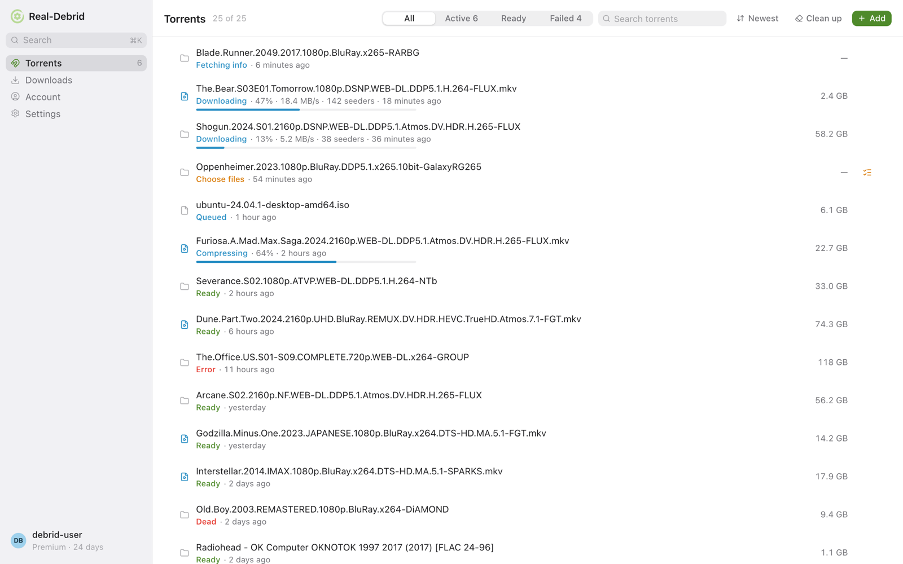
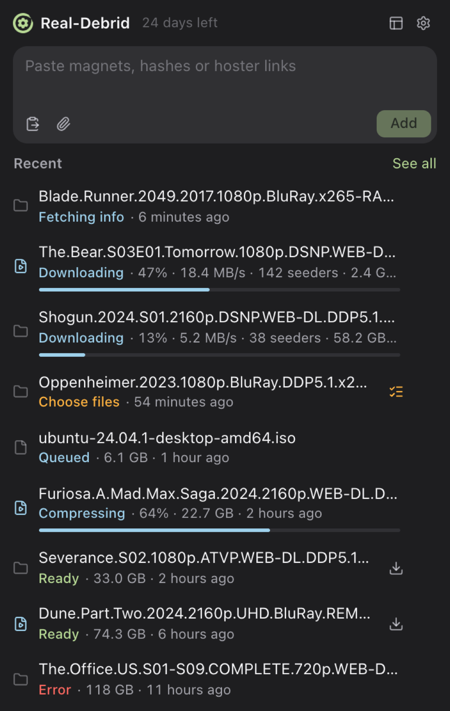
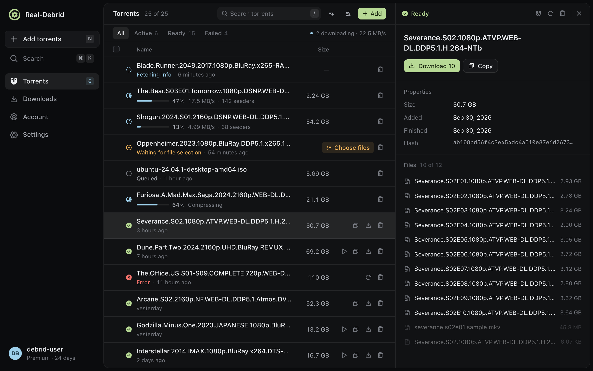
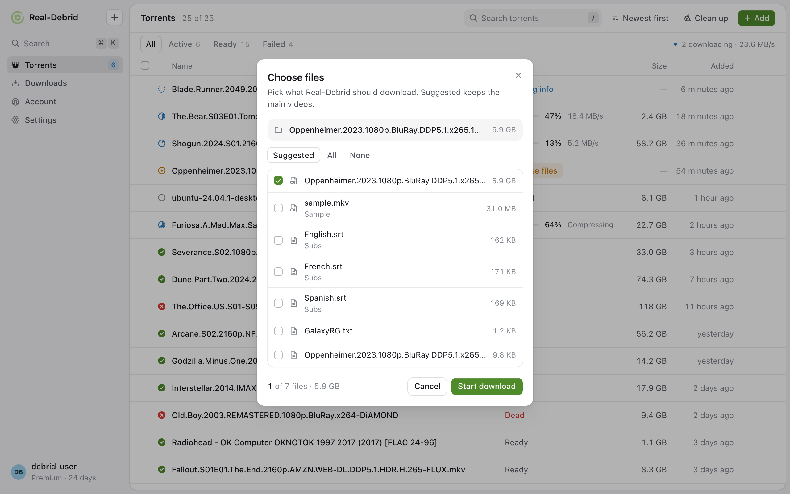
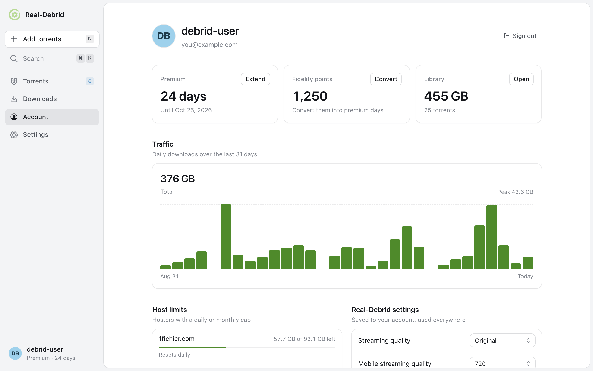
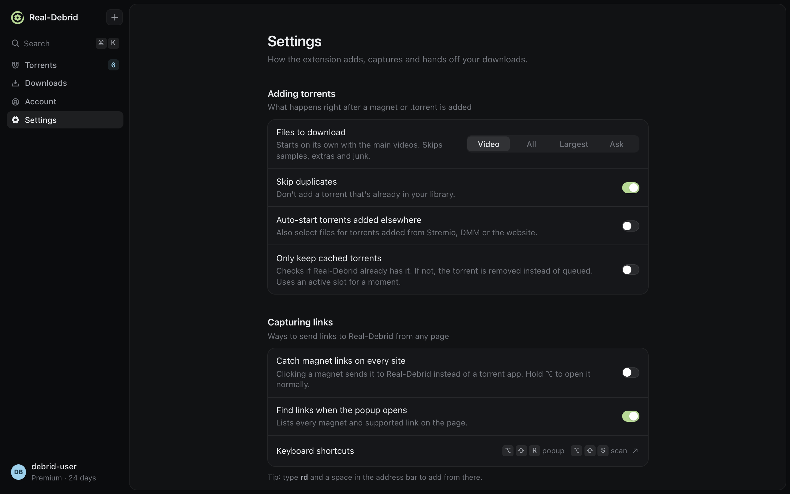
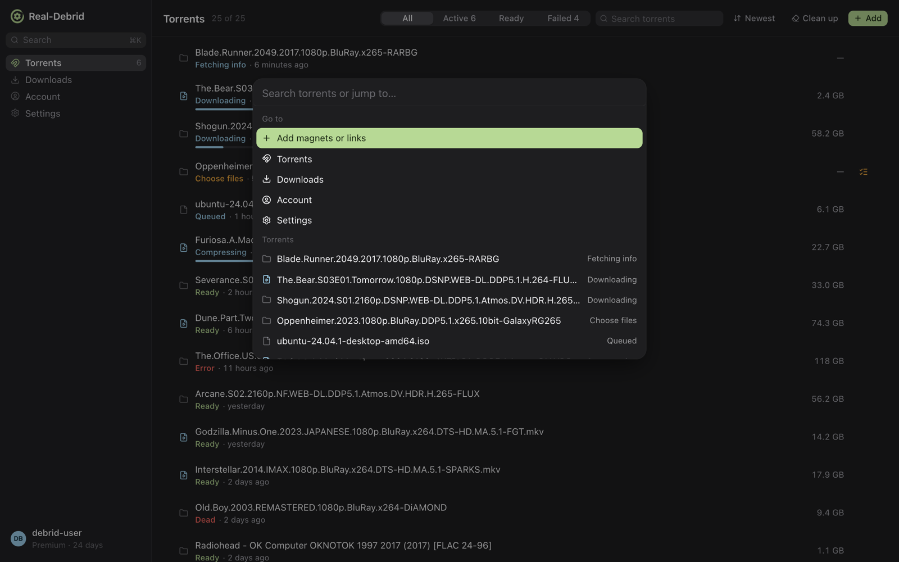

<p align="center">
  
</p>

<h1 align="center">Real-Debrid Manager</h1>

<p align="center">
  Capture links, manage torrents and run your Real-Debrid account from the browser.
</p>

<p align="center">
  <a href="https://chromewebstore.google.com/detail/real-debrid-manager/fengaeiifddaadaibopcibcdakiaaian"></a>
  <a href="https://addons.mozilla.org/en-US/firefox/addon/realdebrid-manager/"></a>
  
  
</p>

---

<p align="center">
  
</p>

<details>
<summary>More screenshots</summary>
<br>

| | |
|:---:|:---:|
|  |  |
| Popup | Torrent details |
|  |  |
| File picker | Account and traffic |
|  |  |
| Settings | Command palette |

</details>

## Features

**Capture**
- Paste magnets, info hashes, hoster links or folders; drop `.torrent` files
- Right-click any link or selected text, or type `rd` in the address bar
- The popup finds every magnet and supported link on the current page
- Optionally catch magnet clicks on every site

**Torrents**
- Starts automatically: picks the main video files and skips samples, extras and junk (or all, largest, or ask)
- Skips torrents already in your library; optional "only keep cached"
- Live progress, badge count, and notifications when torrents finish or fail
- Search, filter, sort, bulk actions, dedupe, cleanup of failed torrents, and one-click reinsert for expired links

**Downloads**
- Download in the browser, stream in a built-in player, copy links, or open in IINA, VLC or Infuse

**Account**
- Premium days, fidelity points conversion, 31-day traffic chart, host quotas, Real-Debrid streaming settings
- Premium expiry reminder

## Install from source

```bash
bun install
bun run build            # Chromium: load .output/chrome-mv3 unpacked
bun run build:firefox    # .output/firefox-mv3
bun run build:safari     # then build safari-extension/Real-Debrid Manager in Xcode
```

## Development

```bash
bun run dev       # HMR dev build
bun run test      # unit tests
bun run e2e       # screenshots and smoke checks against a mocked API
bun run compile   # typecheck
```

## License

MIT
